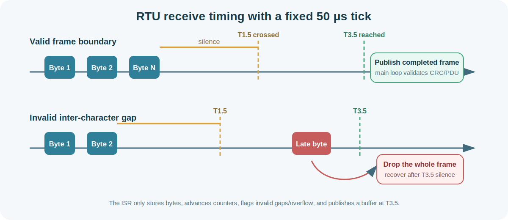

<p align="center">
  
</p>

# STM32 Modbus TCP Server for Cortex‑M4

A compact Modbus implementation written in portable C11, with an STM32/lwIP raw-API TCP transport, host-tested Modbus RTU slave and master ADU cores, a portable RTU master transaction engine with deterministic timeouts and retries, a deterministic in-memory register map, strict request validation, and no heap allocation in the request path.

The repository builds and tests on a normal Linux/macOS development machine. The RTU slave layer validates complete frames, provides single-byte receive and fixed 50 microsecond timing entry points, detects T1.5/T3.5 boundaries, and reuses the same PDU engine as TCP. The separate RTU master core builds complete requests and validates complete responses without depending on hardware. The portable master transaction engine adds one-outstanding-request state management, response deadlines, retry delays, transport-completion/error events, broadcast completion, and bounded diagnostics. UART receive framing, board-specific UART/timer glue, RS-485 direction control, and CubeMX integration remain separate.

## Build status

The default build verifies all portable code and compile-checks the lwIP transport against API-compatible headers:

```bash
make
make test
```

`make test` runs:

- Modbus CRC-16 known-vector and corruption tests
- direct C unit tests for the shared Modbus PDU engine
- host tests for the Modbus RTU ADU wrapper, addressing, CRC, and broadcasts
- host tests for RTU master request builders, response validation, exceptions, and decoding
- host tests for RTU master transaction state, deadlines, retries, transport events, broadcast handling, and diagnostics
- fake-timer tests for T1.5/T3.5, buffering, overflow, recovery, and transmit dispatch
- C unit tests for the register map and Modbus TCP ADU wrapper
- the on-device register self-test as a host executable
- strict `-Wall -Wextra -Wpedantic -Wconversion -Wsign-conversion -Wshadow -Werror` compile checks
- a real TCP socket integration test against the included POSIX demo server

A GitHub Actions workflow and a Docker build are included.

## Architecture

<p align="center">
  
</p>

The design separates the shared PDU engine from transport framing and network I/O:

- `mb_process_pdu()` dispatches function codes and creates normal or exception response PDUs without TCP-specific framing.
- `mbtcp_process_adu()` validates MBAP fields, invokes the shared PDU API, and builds the Modbus TCP response ADU.
- `mbrtu_process_adu()` validates the RTU address and CRC, applies broadcast rules, invokes the same PDU API, and builds the RTU response ADU.
- `mbrtum_build_*_request()` creates complete RTU master requests, while `mbrtum_process_response()` validates matching complete responses and Modbus exceptions.
- `mbrtum_transaction_*()` owns one active request, drives asynchronous transmit/wait/retry states, enforces wrap-safe deadlines, reuses the complete-frame master validator, and exposes bounded diagnostics.
- `mbrtu_on_rx_byte_isr()` and `mbrtu_on_50us_tick_isr()` assemble frames with minimal interrupt work; `mbrtu_poll()` processes and transmits them from the main loop.
- `mb_crc16()` implements the Modbus serial-line CRC-16 with low-byte-first wire order.
- `modbus_tcp.c` handles lwIP TCP callbacks, fragmented/coalesced stream data, client slots, and response transmission.
- `modbus.c` provides the default fixed-size coils and register banks.
- weak write hooks connect Modbus writes to relays, PWM, configuration storage, or other application logic.

## Supported function codes

| Function | Code | Maximum per request | Access |
|---|---:|---:|---|
| Read Coils | `0x01` | 2,000 bits | Read |
| Read Discrete Inputs | `0x02` | 2,000 bits | Read |
| Read Holding Registers | `0x03` | 125 registers | Read |
| Read Input Registers | `0x04` | 125 registers | Read |
| Write Single Coil | `0x05` | 1 bit | Write |
| Write Single Register | `0x06` | 1 register | Write |
| Write Multiple Coils | `0x0F` | 1,968 bits | Write |
| Write Multiple Registers | `0x10` | 123 registers | Write |

Illegal functions, addresses, quantities, byte counts, and values produce standard Modbus exception responses.

## Repository layout

```text
App/
├── include/
│   ├── modbus.h              Register-map API and write hooks
│   ├── modbus_pdu.h          Shared transport-independent PDU API
│   ├── modbus_protocol.h     Backward-compatible Modbus TCP ADU API
│   ├── modbus_crc16.h        Portable Modbus serial CRC-16 API
│   ├── modbus_rtu.h          RTU ADU plus byte/timing server API
│   ├── modbus_rtu_master.h   Complete-frame RTU master API
│   ├── modbus_rtu_master_transaction.h
│   │                          Portable master timeout/retry transaction API
│   ├── modbus_tcp.h          lwIP server API
│   └── platform_port.h       Compile-time configuration
└── src/
    ├── modbus.c              Coils and register storage
    ├── modbus_protocol.c     Shared PDU engine and TCP ADU wrapper
    ├── modbus_crc16.c        Table-free Modbus CRC-16 implementation
    ├── modbus_rtu.c          RTU ADU and bare-metal timing state machine
    ├── modbus_rtu_master.c   Complete-frame RTU master core
    ├── modbus_rtu_master_transaction.c
    │                          Portable master transaction state machine
    ├── modbus_tcp.c          lwIP raw-API transport
    └── platform_stm32.c      HAL tick and optional RTOS locking

Examples/
├── posix_server.c            Local functional demo
├── stm32_cube_main.c         CubeMX integration reference
└── STM32F767_RTU_Master/    Externally validated STM32F767 RTU master example

Tests/
├── host/                     Unit, transaction, and socket-level tests
├── mocks/lwip/               Compile-check headers only
└── stm32/                    Register-map self-test for a target board

docs/
├── modbus-rtu-core.md
├── modbus-rtu-master-core.md
├── modbus-rtu-master-transaction.md
├── modbus-rtu-timing.md
└── stm32f767-rtu-validation.md
```

## Quick start on a development machine

Requirements: a C11 compiler, Make, and Python 3.

```bash
git clone <your-repository-url>
cd stm32-modbus-tcp-server
make test
```

Expected result:

```text
modbus CRC-16 tests: PASS
modbus PDU tests: PASS
modbus RTU ADU tests: PASS
modbus RTU master tests: PASS
modbus RTU master transaction tests: PASS
modbus RTU timing tests: PASS
modbus protocol tests: PASS
Modbus SelfTest: total=5, passed=5, failed=0, first_err=0
Modbus TCP smoke test: PASS (127.0.0.1:15020)
```

### CMake

```bash
cmake -S . -B build-cmake -DCMAKE_BUILD_TYPE=Release
cmake --build build-cmake --parallel
ctest --test-dir build-cmake --output-on-failure
```

### Docker

```bash
docker build -t stm32-modbus-tcp .
docker run --rm stm32-modbus-tcp
```

## Run the local Modbus TCP demo

The POSIX demo makes it possible to test the same protocol core before hardware is available. It listens on loopback only and defaults to unprivileged port `1502`.

Terminal 1:

```bash
make demo
./build/modbus_posix_server 1502
```

Terminal 2:

```bash
python3 Tests/host/ci_modbus_smoke.py 127.0.0.1 1502
```

The smoke test writes and reads holding registers and coils, then verifies an illegal-address exception.

## Use the portable Modbus RTU ADU core

The complete-frame RTU API can be used directly, or the portable bare-metal layer can turn UART byte events and a fixed 50 microsecond tick into complete frames.

An RTU request buffer has this layout:

```text
slave address | function and data PDU | CRC low | CRC high
```

Include the RTU and CRC sources with the shared register/PDU sources:

```text
App/src/modbus.c
App/src/modbus_protocol.c
App/src/modbus_crc16.c
App/src/modbus_rtu.c
```

Example complete-frame processing:

```c
#include "modbus_rtu.h"

uint8_t response[MODBUS_RTU_ADU_MAX_SIZE];
size_t response_len = 0u;

int result = mbrtu_process_adu(1u,
                               request,
                               request_len,
                               response,
                               sizeof(response),
                               &response_len);

if (result == MBRTU_RESPONSE_READY) {
    uart_transmit(response, response_len);
}
```

Behavior:

- configured slave addresses must be `1` through `247`
- address `0` is broadcast
- valid broadcast writes are applied without a response
- broadcast reads, frames for another slave, invalid CRC frames, and invalid RTU lengths are silently ignored
- normal and exception responses include a newly generated low-byte-first CRC
- no dynamic allocation is used

### Portable RTU master request and response core

The separate master core builds complete FC01, FC02, FC03, FC04, FC05, FC06,
FC0F, and FC10 request ADUs and validates one complete response against the
original request descriptor. It checks CRC, address, function, byte count,
packed-bit padding, write acknowledgements, and Modbus exception responses.

The complete-frame master core intentionally does not own UART framing,
response timeouts, retries, STM32 HAL integration, or RS-485 direction control.
See [`docs/modbus-rtu-master-core.md`](docs/modbus-rtu-master-core.md) for the
public contract, examples, limits, validation rules, and next-stage boundary.

The byte/timing API adds single-byte receive events, a fixed 50 microsecond tick, T1.5/T3.5 frame detection, two-buffer ownership, overflow recovery, and main-loop transmission. See [`docs/modbus-rtu-timing.md`](docs/modbus-rtu-timing.md) for the complete contract and STM32 integration boundary.

### Bare-metal byte and timing example

```c
static mbrtu_context_t rtu;
static uint8_t rx_a[MODBUS_RTU_ADU_MAX_SIZE];
static uint8_t rx_b[MODBUS_RTU_ADU_MAX_SIZE];
static uint8_t response[MODBUS_RTU_ADU_MAX_SIZE];

const mbrtu_config_t config = {
    .slave_address = 1u,
    .baud_rate = 19200u,
    .data_bits = 8u,
    .parity_bits = 1u,
    .stop_bits = 1u,
    .receive_buffer_a = rx_a,
    .receive_buffer_b = rx_b,
    .receive_buffer_capacity = sizeof(rx_a),
    .response_buffer = response,
    .response_buffer_capacity = sizeof(response),
    .transmit = uart_transmit,
    .user_context = NULL
};

(void)mbrtu_init(&rtu, &config);
```

Call `mbrtu_on_rx_byte_isr()` for each received byte, call `mbrtu_on_50us_tick_isr()` every 50 microseconds, and call `mbrtu_poll()` regularly from the main loop. CRC calculation, function dispatch, application write hooks, and response transmission never run from the receive or timing ISR.

<p align="center">
  
</p>

## STM32CubeMX integration

This repository intentionally does not ship fabricated board startup code, a linker script, PHY configuration, or Ethernet pin assignments. Those settings must match the selected STM32 and board.

### 1. Generate the board project

In STM32CubeMX or STM32CubeIDE:

1. Select the exact MCU or development board.
2. Enable Ethernet and configure the correct RMII/MII pins and PHY address.
3. Enable lwIP.
4. Select the lwIP raw API. The included transport does not require Netconn or BSD sockets.
5. For a no-RTOS project, ensure the generated main loop calls `MX_LWIP_Process()`.
6. Generate the project with its HAL, CMSIS, startup, linker, Ethernet, and lwIP files.

### 2. Add the application sources

For Modbus TCP, add these files to the generated build:

```text
App/src/modbus.c
App/src/modbus_protocol.c
App/src/modbus_tcp.c
App/src/platform_stm32.c
```

For the host-tested RTU ADU core, also add:

```text
App/src/modbus_crc16.c
App/src/modbus_rtu.c
```

The portable receive/timing state machine is included. The STM32 UART interrupt, timer/SysTick setup, and HAL time-base preservation remain board-specific.

Add this include directory:

```text
App/include
```

For a CubeIDE project, copy the `App` directory into the project, refresh the workspace, and ensure the source folder is not excluded from the active build configuration.

### 3. Initialize the server

Merge the relevant lines from `Examples/stm32_cube_main.c` into the generated `main.c`:

```c
#include "modbus.h"
#include "modbus_tcp.h"

/* After MX_LWIP_Init(): */
mb_init();
mbtcp_init();

/* In a no-RTOS superloop: */
MX_LWIP_Process();
mbtcp_poll();
```

Initialize the server only after the Ethernet interface and lwIP are initialized.

### 4. Configure the data model

Edit `App/include/platform_port.h` or pass equivalent compiler definitions:

```c
#define MBTCP_SERVER_PORT       502u
#define MBTCP_MAX_CLIENTS       3u
#define MB_MAX_COILS            256u
#define MB_MAX_DISCRETE_INPUTS  256u
#define MB_MAX_HREGS            256u
#define MB_MAX_IREGS            256u
```

<p align="center">
  
</p>

### 5. Connect writes to hardware

Override either weak hook in an application source file:

```c
void mb_on_write_coil(uint16_t address, uint8_t value)
{
    if (address == 0u) {
        HAL_GPIO_WritePin(RELAY_GPIO_Port,
                          RELAY_Pin,
                          value != 0u ? GPIO_PIN_SET : GPIO_PIN_RESET);
    }
}

void mb_on_write_hreg(uint16_t address, uint16_t value)
{
    if (address == 0u) {
        set_pwm_duty(value);
    }
}
```

Update read-only values from the application:

```c
mb_set_ireg(0u, adc_sample);
mb_set_dinput(0u, digital_input_state);
```

### 6. FreeRTOS locking

Define `WITH_RTOS` when multiple tasks access the map. `platform_stm32.c` then uses a FreeRTOS mutex. For stricter real-time requirements, create the mutex during application initialization and replace the default lazy initialization with your project’s synchronization policy.

## TCP packet processing

<p align="center">
  
</p>

The lwIP transport supports:

- TCP frames split across multiple pbufs or receive callbacks
- multiple Modbus ADUs arriving in one TCP stream
- a fixed maximum ADU of 260 bytes
- up to `MBTCP_MAX_CLIENTS` active connections
- no dynamic allocation by the application code

## On-device self-test

Add these files to a temporary target build:

```text
Tests/stm32/register_selftest.c
Tests/stm32/register_selftest.h
```

Then run:

```c
MbSelfTestResult result;
char line[128];

mb_selftest_run(&result);
mb_selftest_print(line, sizeof(line), &result);
printf("%s", line);
```

The self-test exercises all four data banks, boundary behavior, and deterministic bulk patterns without requiring Ethernet.

## Test a physical board

After flashing and assigning an IP address:

```bash
python3 Tests/host/ci_modbus_smoke.py 192.168.1.50 502
```

Or use a third-party Modbus client. Protocol addresses are zero-based in requests; some tools display holding register address `0` as `40001`.

Useful Wireshark filters are in `tools/wireshark_display_filter.md`.

## Memory use

With the default map sizes, data storage uses approximately:

- 256 bytes for coils
- 256 bytes for discrete inputs
- 512 bytes for holding registers
- 512 bytes for input registers
- 260 bytes of receive buffering per active lwIP client
- up to 256 bytes each for caller-owned RTU request and response buffers when maximum-size frames are supported

The exact flash and RAM totals depend on compiler settings, lwIP configuration, HAL, PHY driver, and the chosen STM32.

## Security

Modbus TCP provides no authentication, confidentiality, or authorization. Do not expose port 502 directly to the public internet. Use network segmentation, firewall rules, a VPN, or a security gateway, and validate all hardware actions in the write hooks.

## Troubleshooting

**The host build passes, but the STM32 project does not compile.**  
Check that CubeMX generated lwIP raw-API headers, `App/include` is in the include path, and all required `App/src` files are part of the active target.

**The server does not accept connections.**  
Verify PHY link status, MAC/PHY address configuration, IP address assignment, and that `MX_LWIP_Process()` runs continuously in no-RTOS projects.

**Port 502 cannot be opened on a desktop.**  
Ports below 1024 may require elevated privileges. Use the included demo on port 1502 instead.

**A client reports an illegal data address.**  
The requested address range exceeds the configured bank size. Remember that protocol addresses are zero-based.

## License

MIT — see [LICENSE](LICENSE).
